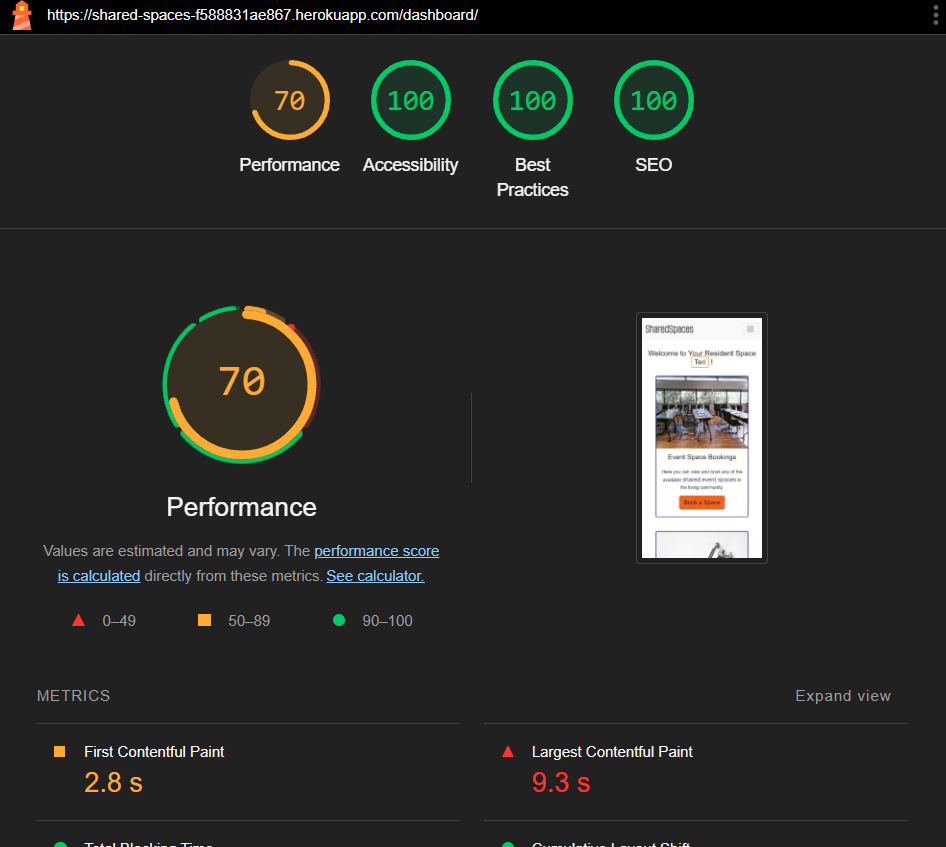
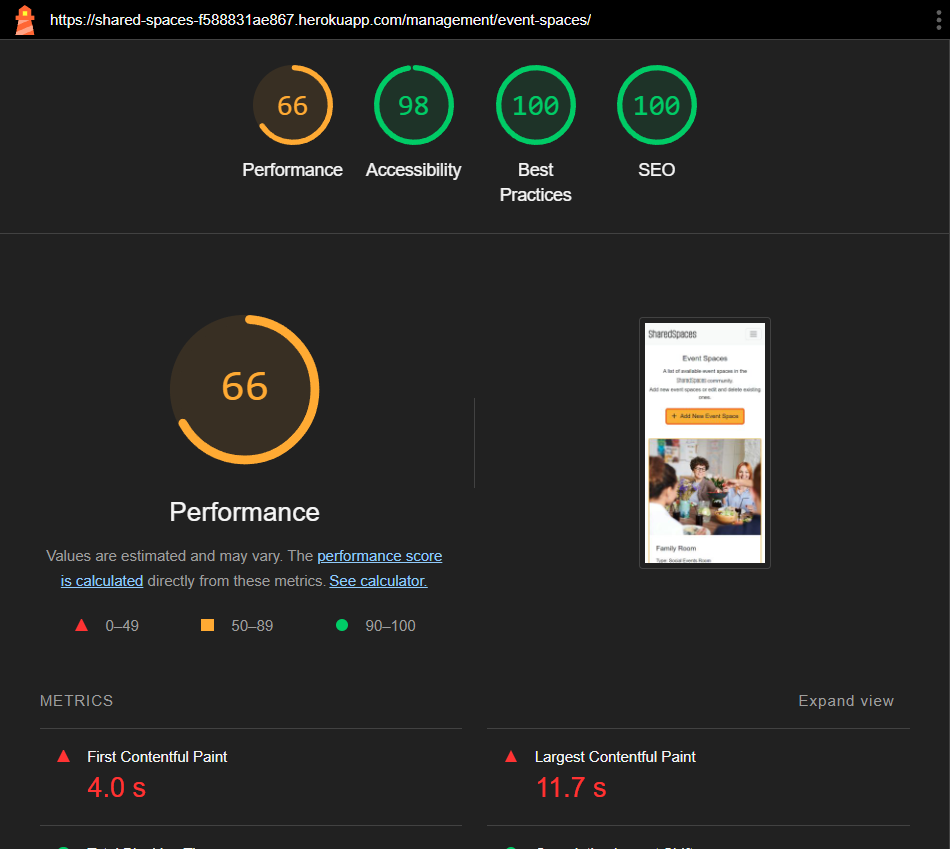

# Testing

> [!NOTE]
> Return back to the [README.md](README.md) file.

## Code Validation

### HTML

I have used the recommended [HTML W3C Validator](https://validator.w3.org) to validate all of my HTML files.

| Directory | File | URL | Screenshot |
| --- | --- | --- | --- | 
| main | [index.html](https://github.com/theresaabl/shared-spaces/blob/main/main/templates/main/index.html) | [Link](https://validator.w3.org/nu/?doc=https%3A%2F%2Fshared-spaces-f588831ae867.herokuapp.com%2F) |  | 
| contact | [contact.html](https://github.com/theresaabl/shared-spaces/blob/main/contact/templates/contact/contact.html) | [Link](https://validator.w3.org/nu/?doc=https%3A%2F%2Fshared-spaces-f588831ae867.herokuapp.com%2Fcontact%2F) |  | 
| dashboard | [resident_space.html](https://github.com/theresaabl/shared-spaces/blob/main/dashboard/templates/dashboard/resident_space.html) |  |  | 
| dashboard | [event_space_booking.html](https://github.com/theresaabl/shared-spaces/blob/main/dashboard/templates/dashboard/event_space_booking.html) |  |  | 
| dashboard | [event_spaces_list.html](https://github.com/theresaabl/shared-spaces/blob/main/dashboard/templates/dashboard/event_spaces_list.html) |  |  | 
| dashboard | [submit_request.html](https://github.com/theresaabl/shared-spaces/blob/main/dashboard/templates/dashboard/submit_request.html) | |  | 
| management | [management_page.html](https://github.com/theresaabl/shared-spaces/blob/main/management/templates/management/management_page.html) | |  |
| management | [users.html](https://github.com/theresaabl/shared-spaces/blob/main/management/templates/management/users.html) | |  | 
| management | [event_spaces.html](https://github.com/theresaabl/shared-spaces/blob/main/management/templates/management/event_spaces.html) | |  | 
| management | [manage_event_spaces.html](https://github.com/theresaabl/shared-spaces/blob/main/management/templates/management/manage_event_spaces.html) | |  | 
| management | [event_space_bookings.html](https://github.com/theresaabl/shared-spaces/blob/main/management/templates/management/event_space_bookings.html) | |  | 
| management | [resident_requests.html](https://github.com/theresaabl/shared-spaces/blob/main/management/templates/management/resident_requests.html) | |  | 
| management | [contact_messages.html](https://github.com/theresaabl/shared-spaces/blob/main/management/templates/management/contact_messages.html) | |  | 
| templates | [404.html](https://github.com/theresaabl/shared-spaces/blob/main/templates/404.html) |  |  | 
| templates/account/ | [signup.html](https://github.com/theresaabl/shared-spaces/blob/main/templates/account/signup.html) | [Link](https://validator.w3.org/nu/?doc=https%3A%2F%2Fshared-spaces-f588831ae867.herokuapp.com%2Faccounts%2Fsignup%2F) |  | 
| templates/account/ | [login.html](https://github.com/theresaabl/shared-spaces/blob/main/templates/account/login.html) | [Link](https://validator.w3.org/nu/?doc=https%3A%2F%2Fshared-spaces-f588831ae867.herokuapp.com%2Fdashboard%2Faccounts%2Flogin%2F) |  | 
| templates/account/ | [logout.html](https://github.com/theresaabl/shared-spaces/blob/main/templates/account/logout.html) |  |  | 

### CSS

I have used the recommended [CSS Jigsaw Validator](https://jigsaw.w3.org/css-validator) to validate all of my CSS files.

| Directory | File | URL | Screenshot | 
| --- | --- | --- | --- | 
| static | [style.css](https://github.com/theresaabl/shared-spaces/blob/main/static/css/style.css) | [Link](https://jigsaw.w3.org/css-validator/validator?uri=https://shared-spaces-f588831ae867.herokuapp.com) |  | 

### JavaScript

I have used the recommended [JShint Validator](https://jshint.com) to validate all of my JS files.

| Directory | File | Screenshot | 
| --- | --- | --- | 
| static | [home.js](https://github.com/theresaabl/shared-spaces/blob/main/static/js/home.js)  |  | 
| static | [edit_bookings.js](https://github.com/theresaabl/shared-spaces/blob/main/static/js/edit_bookings.js)  |  | 
| static | [edit_resident_requests.js](https://github.com/theresaabl/shared-spaces/blob/main/static/js/edit_resident_requests.js)  |  | 
| static | [delete_data.js](https://github.com/theresaabl/shared-spaces/blob/main/static/js/delete_data.js)  |  | 
| static | [event_spaces_list.js](https://github.com/theresaabl/shared-spaces/blob/main/static/js/event_spaces_list.js)  |  | 
| static | [mgmt_edit_event_spaces.js](https://github.com/theresaabl/shared-spaces/blob/main/static/js/mgmt_edit_event_spaces.js)  |  | 
| static | [mgmt_delete_data.js](https://github.com/theresaabl/shared-spaces/blob/main/static/js/mgmt_delete_data.js)  |  | 

### Python

I have used the recommended [PEP8 CI Python Linter](https://pep8ci.herokuapp.com) to validate all of my Python files.

| Directory | File | URL | Screenshot |
| --- | --- | --- | --- |
| contact | [admin.py](https://github.com/theresaabl/shared-spaces/blob/main/contact/admin.py) | [PEP8 CI Link](https://pep8ci.herokuapp.com/https://raw.githubusercontent.com/theresaabl/shared-spaces/main/contact/admin.py) |  | 
| contact | [forms.py](https://github.com/theresaabl/shared-spaces/blob/main/contact/forms.py) | [PEP8 CI Link](https://pep8ci.herokuapp.com/https://raw.githubusercontent.com/theresaabl/shared-spaces/main/contact/forms.py) |  | 
| contact | [models.py](https://github.com/theresaabl/shared-spaces/blob/main/contact/models.py) | [PEP8 CI Link](https://pep8ci.herokuapp.com/https://raw.githubusercontent.com/theresaabl/shared-spaces/main/contact/models.py) |  | 
| contact | [test_forms.py](https://github.com/theresaabl/shared-spaces/blob/main/contact/test_forms.py) | [PEP8 CI Link](https://pep8ci.herokuapp.com/https://raw.githubusercontent.com/theresaabl/shared-spaces/main/contact/test_forms.py) |  |
| contact | [test_views.py](https://github.com/theresaabl/shared-spaces/blob/main/contact/test_views.py) | [PEP8 CI Link](https://pep8ci.herokuapp.com/https://raw.githubusercontent.com/theresaabl/shared-spaces/main/contact/test_views.py) |  | 
| contact | [urls.py](https://github.com/theresaabl/shared-spaces/blob/main/contact/urls.py) | [PEP8 CI Link](https://pep8ci.herokuapp.com/https://raw.githubusercontent.com/theresaabl/shared-spaces/main/contact/urls.py) |  | 
| contact | [views.py](https://github.com/theresaabl/shared-spaces/blob/main/contact/views.py) | [PEP8 CI Link](https://pep8ci.herokuapp.com/https://raw.githubusercontent.com/theresaabl/shared-spaces/main/contact/views.py) |  | 
| dashboard | [admin.py](https://github.com/theresaabl/shared-spaces/blob/main/dashboard/admin.py) | [PEP8 CI Link](https://pep8ci.herokuapp.com/https://raw.githubusercontent.com/theresaabl/shared-spaces/main/dashboard/admin.py) |  |
| dashboard | [forms.py](https://github.com/theresaabl/shared-spaces/blob/main/dashboard/forms.py) | [PEP8 CI Link](https://pep8ci.herokuapp.com/https://raw.githubusercontent.com/theresaabl/shared-spaces/main/dashboard/forms.py) |  | 
| dashboard | [models.py](https://github.com/theresaabl/shared-spaces/blob/main/dashboard/models.py) | [PEP8 CI Link](https://pep8ci.herokuapp.com/https://raw.githubusercontent.com/theresaabl/shared-spaces/main/dashboard/models.py) |  | 
| dashboard | [test_forms.py](https://github.com/theresaabl/shared-spaces/blob/main/dashboard/test_forms.py) | [PEP8 CI Link](https://pep8ci.herokuapp.com/https://raw.githubusercontent.com/theresaabl/shared-spaces/main/dashboard/test_forms.py) |  | 
| dashboard | [test_views.py](https://github.com/theresaabl/shared-spaces/blob/main/dashboard/test_views.py) | [PEP8 CI Link](https://pep8ci.herokuapp.com/https://raw.githubusercontent.com/theresaabl/shared-spaces/main/dashboard/test_views.py) |  |
| dashboard | [urls.py](https://github.com/theresaabl/shared-spaces/blob/main/dashboard/urls.py) | [PEP8 CI Link](https://pep8ci.herokuapp.com/https://raw.githubusercontent.com/theresaabl/shared-spaces/main/dashboard/urls.py) |  | 
| dashboard | [utils.py](https://github.com/theresaabl/shared-spaces/blob/main/dashboard/utils.py) | [PEP8 CI Link](https://pep8ci.herokuapp.com/https://raw.githubusercontent.com/theresaabl/shared-spaces/main/dashboard/utils.py) |  | 
| dashboard | [views.py](https://github.com/theresaabl/shared-spaces/blob/main/dashboard/views.py) | [PEP8 CI Link](https://pep8ci.herokuapp.com/https://raw.githubusercontent.com/theresaabl/shared-spaces/main/dashboard/views.py) |  | 
| main | [test_views.py](https://github.com/theresaabl/shared-spaces/blob/main/main/test_views.py) | [PEP8 CI Link](https://pep8ci.herokuapp.com/https://raw.githubusercontent.com/theresaabl/shared-spaces/main/main/test_views.py) |  | 
| main | [urls.py](https://github.com/theresaabl/shared-spaces/blob/main/main/urls.py) | [PEP8 CI Link](https://pep8ci.herokuapp.com/https://raw.githubusercontent.com/theresaabl/shared-spaces/main/main/urls.py) |  |
| main | [views.py](https://github.com/theresaabl/shared-spaces/blob/main/main/views.py) | [PEP8 CI Link](https://pep8ci.herokuapp.com/https://raw.githubusercontent.com/theresaabl/shared-spaces/main/main/views.py) |  | 
|  | [manage.py](https://github.com/theresaabl/shared-spaces/blob/main/manage.py) | [PEP8 CI Link](https://pep8ci.herokuapp.com/https://raw.githubusercontent.com/theresaabl/shared-spaces/main/manage.py) |  | 
| management | [forms.py](https://github.com/theresaabl/shared-spaces/blob/main/management/forms.py) | [PEP8 CI Link](https://pep8ci.herokuapp.com/https://raw.githubusercontent.com/theresaabl/shared-spaces/main/management/forms.py) |  | 
| management | [test_forms.py](https://github.com/theresaabl/shared-spaces/blob/main/management/test_forms.py) | [PEP8 CI Link](https://pep8ci.herokuapp.com/https://raw.githubusercontent.com/theresaabl/shared-spaces/main/management/test_forms.py) |  |
| management | [test_views.py](https://github.com/theresaabl/shared-spaces/blob/main/management/test_views.py) | [PEP8 CI Link](https://pep8ci.herokuapp.com/https://raw.githubusercontent.com/theresaabl/shared-spaces/main/management/test_views.py) |  | 
| management | [urls.py](https://github.com/theresaabl/shared-spaces/blob/main/management/urls.py) | [PEP8 CI Link](https://pep8ci.herokuapp.com/https://raw.githubusercontent.com/theresaabl/shared-spaces/main/management/urls.py) |  | 
| management | [views.py](https://github.com/theresaabl/shared-spaces/blob/main/management/views.py) | [PEP8 CI Link](https://pep8ci.herokuapp.com/https://raw.githubusercontent.com/theresaabl/shared-spaces/main/management/views.py) |  | 
| sharedspaces | [settings.py](https://github.com/theresaabl/shared-spaces/blob/main/sharedspaces/settings.py) | [PEP8 CI Link](https://pep8ci.herokuapp.com/https://raw.githubusercontent.com/theresaabl/shared-spaces/main/sharedspaces/settings.py) |  | 
| sharedspaces | [urls.py](https://github.com/theresaabl/shared-spaces/blob/main/sharedspaces/urls.py) | [PEP8 CI Link](https://pep8ci.herokuapp.com/https://raw.githubusercontent.com/theresaabl/shared-spaces/main/sharedspaces/urls.py) |  | 

## Responsiveness

I've tested my deployed project to check for responsiveness issues. I have tested on the following real devices: Mobile (Samsung Galaxy A41), Tablet (Samsung Galaxy Tab S6 Lite), Laptop (Lenovo X1 Extreme), Monitor (Lenovo ThinkVision P24h-10).
| Page | Mobile | Tablet | Desktop | Monitor | Notes |
| --- | --- | --- | --- | --- | -- |
| Register |  |  |  |  | Works as expected |
| Login |  |  |  |  | Works as expected |
| Logout |  |  |  |  | Works as expected |
| Account Inactive | |  |  |  | Works as expected |
| Home |  |  |  |  | Works as expected |
| About |  |  |  |  | Works as expected |
| Contact |  |  |  |  | Works as expected |
| Resident Space |  |  |  |  | Works as expected |
| Resident Space unauthenticated users |  |  |  |  | Works as expected |
| Event Space Booking |  |  |  |  | Works as expected |
| Submit a Request |  |  |  |  | Works as expected |
| Event Spaces List |  |  |  |  | Works as expected |
| Admin Space |  |  |  |  | Works as expected |
| Manage User Accounts |  |  |  |  | Works as expected |
| Manage Event Spaces |  |  |  |  | Works as expected |
| Add New Event Space |  |  |  |  | Works as expected |
| Manage Event Space Bookings |  |  |  |  | Works as expected |
| Manage Resident Requests |  |  |  |  | Works as expected |
| Manage Contact Messages |  |  |  |  | Works as expected |
| Error 404 Page |  | |  |  | Works as expected |

## Browser Compatibility

I've tested my deployed project on multiple browsers to check for compatibility issues. Everything worked as expected, there are only slight differences in the appearance of font weight and look of the logo in Firefox.

| Page | [Chrome](https://www.google.com/chrome) |  [Firefox](https://www.mozilla.org/firefox) | [Edge](https://www.microsoft.com/edge) | Notes |
| --- | --- | --- | --- | --- |
| Register |  |  |   | Works as expected |
| Login |  |  |   | Works as expected |
| Logout |  |  |  |  Works as expected |
| Account Inactive |  |  |  | Works as expected |
| Home |  |  |  | Works as expected |
| About |  |  |   | Works as expected |
| Contact |  |  |   | Works as expected |
| Resident Space |  |  |   | Works as expected |
| Resident Space unauthenticated users |  |  |  |  | Works as expected |
| Event Space Booking |  |  |   | Works as expected |
| Submit a Request |  |  |   | Works as expected |
| Event Spaces List |  |  |  | Works as expected |
| Admin Space |  |  |  |  Works as expected |
| Manage User Accounts |  |  |   | Works as expected |
| Manage Event Spaces |  |  |   | Works as expected |
| Add New Event Space |  |  |   | Works as expected |
| Manage Event Space Bookings |  |  |   | Works as expected |
| Manage Resident Requests |  |  |  | Works as expected |
| Manage Contact Messages |  |  |   | Works as expected |
| Error 404 Page |  |  |  | Works as expected |

## Lighthouse Audit

⚠️ INSTRUCTIONS ⚠️

Use this space to discuss testing the live/deployed site's Lighthouse Audit reports. Avoid testing the local version (Gitpod/VSCode/etc.), as this can have knock-on effects for performance. If you don't have "Lighthouse" in your Developer Tools, it can be added as an [extension](https://chrome.google.com/webstore/detail/lighthouse/blipmdconlkpinefehnmjammfjpmpbjk).

Unless your project is a single-page application (SPA), you should test Lighthouse Audit results for all of your pages, for both *mobile* and *desktop*.

**IMPORTANT**: You must provide screenshots of the results, to "prove" that you've actually tested them.

⚠️ --- END --- ⚠️

I've tested my deployed project using the Lighthouse Audit tool to check for any major issues. Some warnings are outside of my control, and mobile results tend to be lower than desktop. For a future release it would make sense to improve the performance score by optimizing the image sizes, for this release the performance score is fast enough and more importantly the most important pages where data is manipulated do have a good score.

| Page | Mobile | Desktop |
| --- | --- | --- |
| Register |  |    |
| Login |  |  | 
| Logout |  |  | 
| Account Inactive |  |  | 
| Home |  |  |  
| About |  |  |  
| Contact |  |  |  
| Resident Space |  |  |  
| Resident Space unauthenticated users |  |  |   | 
| Event Space Booking |  |  |  
| Submit a Request |  |  | 
| Event Spaces List |  |  |
| Admin Space |  |  | 
| Manage User Accounts |  |  | 
| Manage Event Spaces |  |  |  
| Add New Event Space |  |  | 
| Manage Event Space Bookings |  |  |
| Manage Resident Requests |  |  | 
| Manage Contact Messages |  |  | 

## Defensive Programming

⚠️ INSTRUCTIONS ⚠️

Defensive programming (defensive design) is extremely important! When building projects that accept user inputs or forms, you should always test the level of security for each form field. Examples of this could include (but not limited to):

All Projects:

- Users cannot submit an empty form (add the `required` attribute)
- Users must enter valid field types (ensure the correct input `type=""` is used)
- Users cannot brute-force a URL to navigate to a restricted pages

Python Projects:

- Users cannot perform CRUD functionality if not authenticated (if login functionality exists)
- User-A should not be able to manipulate data belonging to User-B, or vice versa
- Non-Authenticated users should not be able to access pages that require authentication
- Standard users should not be able to access pages intended for superusers/admins

You'll want to test all functionality on your application, whether it's a standard form, or CRUD functionality, for data manipulation on a database. Try to access various pages on your site as different user types (User-A, User-B, guest user, admin, superuser). You should include any manual tests performed, and the expected results/outcome.

Testing should be replicable (can someone else replicate the same outcome?). Ideally, tests cases should focus on each individual section of every page on the website. Each test case should be specific, objective, and step-wise replicable.

Instead of adding a general overview saying that everything works fine, consider documenting tests on each element of the page (eg. button clicks, input box validation, navigation links, etc.) by testing them in their "happy flow", their "bad/exception flow", mentioning the expected and observed results, and drawing a parallel between them where applicable.

Consider using the following format for manual test cases:

- Expected Outcome / Test Performed / Result Received / Fixes Implemented

- **Expected**: "Feature is expected to do X when the user does Y."
- **Testing**: "Tested the feature by doing Y."
- (either) **Result**: "The feature behaved as expected, and it did Y."
- (or) **Result**: "The feature did not respond to A, B, or C."
- **Fix**: "I did Z to the code because something was missing."

Use the table below as a basic start, and expand on it using the logic above.

⚠️ --- END --- ⚠️

Defensive programming was manually tested with the below user acceptance testing:

| Page | Expectation | Test | Result | Screenshot |
| --- | --- | --- | --- | --- |
| Blog Management | Feature is expected to allow the blog owner to create new posts with a title, featured image, and content. | Created a new post with valid title, image, and content data. | Post was created successfully and displayed correctly in the blog. |  |
| | Feature is expected to allow the blog owner to update existing posts. | Edited the content of an existing blog post. | Post was updated successfully with the new content. |  |
| | Feature is expected to allow the blog owner to delete blog posts. | Attempted to delete a blog post, confirming the action before proceeding. | Blog post was deleted successfully. |  |
| | Feature is expected to retrieve a list of all published posts. | Accessed the blog owner dashboard to view all published posts. | All published posts were displayed in a list view. |  |
| | Feature is expected to preview posts as drafts before publishing. | Created a draft post and previewed it. | Draft was displayed correctly in preview mode. |  |
| Comments Management | Feature is expected to allow the blog owner to approve or reject comments. | Approved and rejected comments from the dashboard. | Approved comments were published; rejected comments were removed. |  |
| | Feature is expected to allow the blog owner to edit or delete comments. | Edited and deleted existing comments. | Comments were updated or removed successfully. |  |
| User Authentication | Feature is expected to allow registered users to log in to the site. | Attempted to log in with valid and invalid credentials. | Login was successful with valid credentials; invalid credentials were rejected. |  |
| | Feature is expected to allow users to register for an account. | Registered a new user with unique credentials. | User account was created successfully. |  |
| | Feature is expected to allow users to log out securely. | Logged out and tried accessing a restricted page. | Access was denied after logout, as expected. |  |
| User Comments | Feature is expected to allow registered users to leave comments on blog posts. | Logged in and added comments to a blog post. | Comments were successfully added and marked as pending approval. |  |
| | Feature is expected to display a notification that comments are pending approval. | Added a comment and checked the notification message. | Notification was displayed as expected. |  |
| | Feature is expected to allow users to edit their own comments. | Edited personal comments. | Comments were updated as expected. |  |
| | Feature is expected to allow users to delete their own comments. | Deleted personal comments. | Comments were removed as expected. |  |
| Guest Features | Feature is expected to allow guest users to read blog posts without registering. | Opened blog posts as a guest user. | Blog posts were fully accessible without logging in. |  |
| | Feature is expected to display the names of other commenters on posts. | Checked the names of commenters on posts as a guest user. | Commenter names were displayed as expected. |  |
| | Feature is expected to block standard users from brute-forcing admin pages. | Attempted to navigate to admin-only pages by manipulating the URL (e.g., `/admin`). | Access was blocked, and a message was displayed showing denied access. |  |
| 404 Error Page | Feature is expected to display a 404 error page for non-existent pages. | Navigated to an invalid URL (e.g., `/test`). | A custom 404 error page was displayed as expected. |  |

## User Story Testing

⚠️ INSTRUCTIONS ⚠️

Testing User Stories is actually quite simple, once you've already got the stories defined on your README.

Most of your project's **Features** should already align with the **User Stories**, so this should be as simple as creating a table with the User Story, matching with the re-used screenshot from the respective Feature.

⚠️ --- END --- ⚠️

| Target | Expectation | Outcome | Screenshot |
| --- | --- | --- | --- |
| As a blog owner | I would like to create new blog posts with a title, featured image, and content | so that I can share my experiences with my audience. |  |
| As a blog owner | I would like to update existing blog posts | so that I can correct or add new information to my previous stories. |  |
| As a blog owner | I would like to delete blog posts | so that I can remove outdated or irrelevant content from my blog. |  |
| As a blog owner | I would like to retrieve a list of all my published blog posts | so that I can manage them from a central dashboard. |  |
| As a blog owner | I would like to preview a post as draft before publishing it | so that I can ensure formatting and content appear correctly. |  |
| As a blog owner | I would like to review comments before they are published | so that I can filter out spam or inappropriate content. |  |
| As a blog owner | I would like to approve or reject comments from users | so that I can maintain control over the discussion on my posts. |  |
| As a blog owner | I would like to view a list of all comments (both approved and pending) | so that I can manage user engagement effectively. |  |
| As a blog owner | I would like to edit or delete user comments | so that I can clean up or remove inappropriate responses after they've been posted. |  |
| As a registered user | I would like to log in to the site | so that I can leave comments on blog posts. |  |
| As a registered user | I would like to register for an account | so that I can become part of the community and engage with the blog. |  |
| As a registered user | I would like to leave a comment on a blog post | so that I can share my thoughts or ask questions about the owner's experiences. |  |
| As a registered user | I would like my comment to show my name and the timestamp | so that others can see who I am and when I left the comment. |  |
| As a registered user | I would like to receive a notification or message saying my comment is pending approval | so that I understand it hasn't been posted immediately. |  |
| As a registered user | I would like to edit or delete my own comments | so that I can fix mistakes or retract my statement. |  |
| As a guest user | I would like to read blog posts without registering | so that I can enjoy the content without needing to log in. |  |
| As a guest user | I would like to browse past posts | so that I can explore the blog's full content history. |  |
| As a guest user | I would like to register for an account | so that I can participate in the community by leaving comments on posts. |  |
| As a guest user | I would like to see the names of other commenters on posts | so that I can get a sense of community interaction before registering. |  |
| As a user | I would like to see a 404 error page if I get lost | so that it's obvious that I've stumbled upon a page that doesn't exist. |  |

## Automated Testing

I have conducted a series of automated tests on my application.

### Python (Unit Testing)

I have used Django's built-in unit testing framework to test the application functionality. I wrote tests to test the forms and the views of all apps, I tested for page loading statuses, redirects, form validation, form posting, content, context etc. In total I wrote 135 tests to test the functionality of my project. In a real world project, there would be even more extensive tests one could think of and perform.

In order to run the tests, I ran the following command in the terminal:

- `python3 manage.py test`

To create the coverage report, I would then run the following commands:

- `pip3 install coverage`
- `pip3 freeze --local > requirements.txt`
- `coverage run --omit=*/site-packages/*,*/migrations/*,*/__init__.py,env.py,manage.py manage.py test`
- `coverage report`

To see the HTML version of the report, and find out whether some pieces of code were missing, I ran the following commands:

- `coverage html`
- `python3 -m http.server`

Below are the results from the full coverage report on my application that I've tested:

## Bugs

### Fixed Bugs

I have used [GitHub Issues](https://www.github.com/TheresaAbl/shared-spaces/issues) to track and manage bugs and issues during the development stages of my project.

All previously closed/fixed bugs can be tracked [here](https://www.github.com/theresaabl/shared-spaces/issues?q=is%3Aissue+is%3Aclosed+label%3Abug).

Examples:

### Unfixed Bugs

> [!IMPORTANT]
> There are no remaining bugs that I am aware of, though, even after thorough testing, I cannot rule out the possibility.